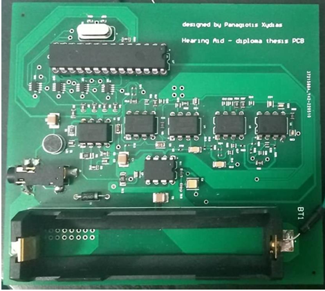

# Custom Hearing Aid Design - Diploma Thesis

## Overview

Welcome to the Custom Hearing Aid Design repository, where innovation meets accessibility in the realm of hearing aid technology. This project represents a groundbreaking diploma thesis that focuses on the design and implementation of a cutting-edge microelectronic device aimed at simulating the functionality of a hearing aid. Rooted in a fusion of theoretical knowledge and practical application, this work strives to bridge the gap between academia and real-world impact.

## Project Highlights

- **Innovative Approach:** This dissertation explores the intricate process of designing and implementing a microelectronic device tailored to emulate the operation of a hearing aid. By leveraging advanced microcontroller technology, we aim to enhance accessibility for individuals with hearing impairment.

- **Comprehensive Analysis:** The project begins with a meticulous analysis of technical parameters, informed by both global research findings and the specific hearing requirements of individuals with hearing impairment. This ensures that our solution is not only technically sound but also addresses real-world needs.

- **Smart Component Selection:** Through rigorous evaluation and testing, we carefully select microcontrollers and integrated circuits to form the backbone of our device. This ensures optimal performance and functionality, paving the way for a seamless user experience.

- **Simulation and Testing:** Extensive simulations and precise measurements are conducted on a test board using state-of-the-art laboratory equipment. This iterative process allows us to validate the viability and effectiveness of our solution before moving forward.

- **Elegant Physical Design:** The project culminates in the design and fabrication of a bespoke PCB board, meticulously crafted to house the fully realized hearing aid prototype. This physical manifestation of our research represents the convergence of theory and practice.

## Repository Contents

This repository contains the following:

- **Arduino IDE Code:** Implementation code for the hearing aid system, developed using the Arduino IDE. This codebase enables seamless integration and customization, empowering users to tailor the device to their specific needs.

- **PCB Design Files:** Comprehensive design files crafted in Altium Designer, offering detailed insights into the architecture and layout of the prototype PCB. These files serve as a blueprint for the physical manifestation of our research.

## Additional Resources

For further exploration, the complete diploma thesis is available for reference at the following link:

[Diploma Thesis - Nemertes Library](https://nemertes.library.upatras.gr/items/dee14091-035d-41c2-a240-8a178baa6b48)

## Keywords

microelectronics, embedded systems, hearing aid

## Preview

